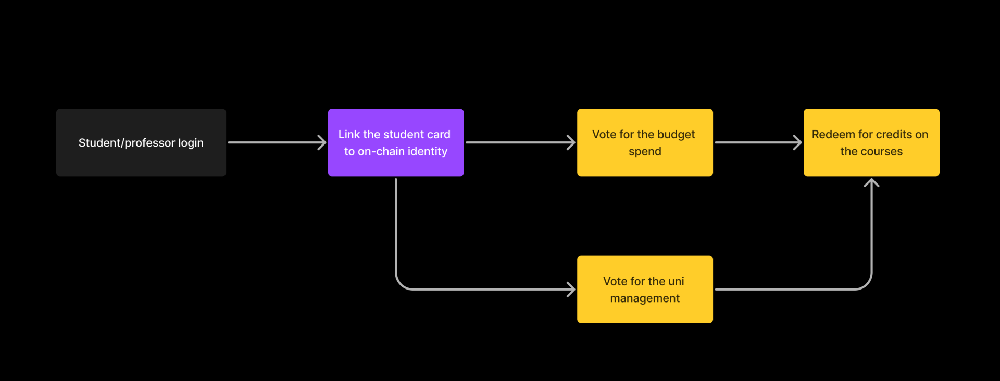

# Universe

[**DEMO LINK**](https://disrupt-uni.vercel.app/)

Universe is a protocol and a dapp proving that a transparent and academic community owned system for public institutions like universities purchases and elections is possible.
<br>
<br>

## Intro 




Helena from our team has been doing the OSINT investigations about corruption in Ukrainian universities.
3.7 million USD was stolen in ONE corruption scheme run by my university management and it took us 5 years to investigate this flow and make it public.
<br>
<br>
Even though in Ukraine there's a "transparent" system for the public institutions purchases, it is centralized and only the university TOPs have access to it.
<br>
<br>
Blockchain should solve it.
<br>
<br>
That’s how she onboarded the whole team into the decision to built a PoC of the transparent public institutions purchasing system for EthIstanbul.
<br>
<br>
1. Students must be able to participate in the governance, vote for the university management and budget spends in a verifiable way where nobody can fake the votes. <br>
2. Universities must spend funds in a transparent way so you can track each purchase and have an easy way to follow through the spends and see the reports and identities of those who receive the funds. <br>
3. Students should have non-monetary incentives to participate in the governance in the way of redeemable credits for the politics/public science/sociology classes. <br>
<br>
This is how we onboard the masses to the blockchain but also nourish civil society and individual responsibility in the decision taking process.


## Run the project

Run the development server:

```bash
npm start
```

Create a production bundle:

```bash
npm run build
```

To run the HaLo NFC verification scan the QR code on your desktop and then touch the NFC chip with your phone.
WorldID verification is only possible if you have the WorldID.
<br>
<br>
Mina Contracts are added to the repo but front end is connected to a simple Ethereum smart contract for the sake of the demo as we encountered some issues with Mina that need more time to be fixed. If you want to use Mina Contracts - it requires the Aura wallet (mina-native wallet).
